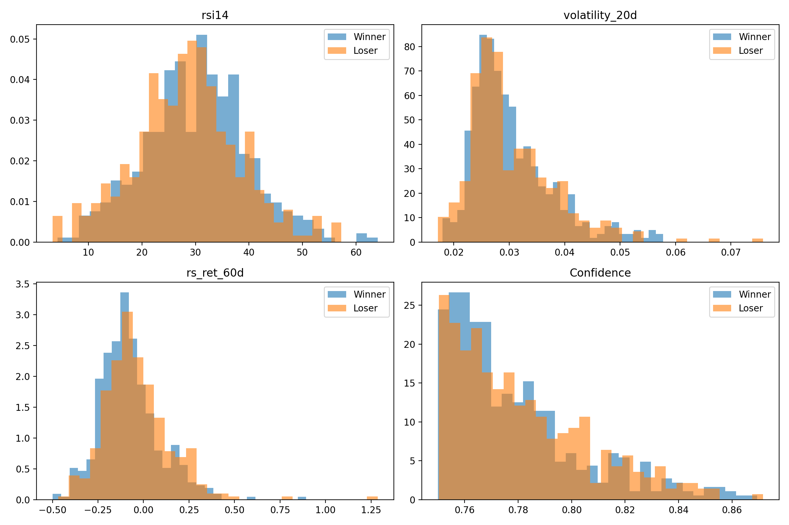
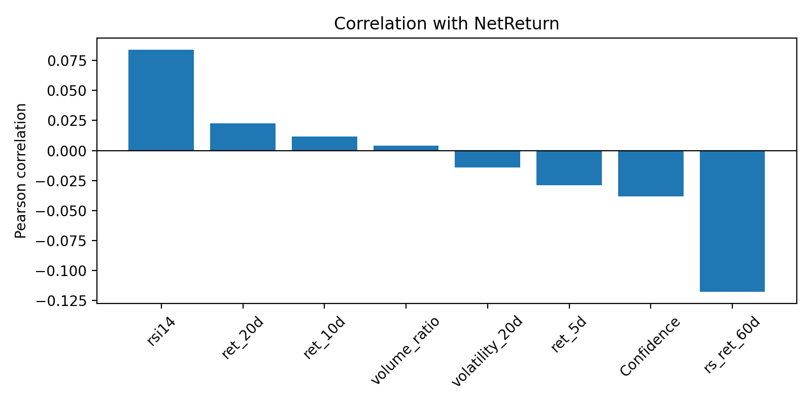

# Trade Feature Analysis

- Source files: c:\Users\HP\Desktop\claude code\stock_ml\backtest_trades.csv and c:\Users\HP\Desktop\claude code\stock_ml\features.csv
- Total trades analyzed: 810
- Winners: 462 | Losers: 348

## 1) Winning vs losing trade comparison

| Feature | Winners mean | Losers mean | Difference | Winner n | Loser n |
|---|---:|---:|---:|---:|---:|
| rsi14 | 30.2133 | 28.3840 | 1.8293 | 462 | 348 |
| rs_ret_60d | -0.0786 | -0.0367 | -0.0420 | 462 | 348 |
| volume_ratio | 1.2860 | 1.2491 | 0.0369 | 462 | 348 |
| ret_10d | -0.1290 | -0.1356 | 0.0065 | 462 | 348 |
| ret_5d | -0.1026 | -0.0999 | -0.0027 | 462 | 348 |
| Confidence | 0.7787 | 0.7813 | -0.0026 | 462 | 348 |
| ret_20d | -0.1718 | -0.1715 | -0.0003 | 462 | 348 |
| volatility_20d | 0.0305 | 0.0305 | 0.0000 | 462 | 348 |

## 2) Distribution plots

## 3) Correlation with profit

| Feature | Correlation with NetReturn |
|---|---:|
| rs_ret_60d | -0.1177 |
| rsi14 | 0.0839 |
| Confidence | -0.0385 |
| ret_5d | -0.0290 |
| ret_20d | 0.0226 |
| volatility_20d | -0.0143 |
| ret_10d | 0.0119 |
| volume_ratio | 0.0041 |

## 4) Top 20 best trades

| Rank | Date | Ticker | NetReturn | Confidence | RSI | Volatility | 5d ret | 10d ret | 20d ret | rs_ret_60d | Volume ratio |
|---|---|---|---:|---:|---:|---:|---:|---:|---:|---:|---:|
| 1 | 2024-11-19 | OLAELEC | 0.3806 | 0.7575 | 35.8871 | 0.0278 | -0.0674 | -0.1425 | -0.1510 | -0.3984 | 0.5718 |
| 2 | 2024-10-07 | NEULANDLAB | 0.3342 | 0.7634 | 33.3944 | 0.0266 | -0.1131 | -0.1118 | -0.1210 | 0.4153 | 1.7021 |
| 3 | 2025-02-14 | GODREJIND | 0.3326 | 0.7565 | 42.9569 | 0.0222 | -0.0928 | -0.1302 | -0.1297 | -0.1802 | 0.8872 |
| 4 | 2024-11-19 | BDL | 0.2592 | 0.7872 | 39.6868 | 0.0297 | -0.0725 | -0.0828 | -0.1348 | -0.2124 | 1.5817 |
| 5 | 2026-03-27 | GRSE | 0.2528 | 0.7738 | 21.3602 | 0.0303 | -0.0991 | -0.1466 | -0.1465 | -0.0205 | 0.9555 |
| 6 | 2024-11-19 | IDEA | 0.2068 | 0.7903 | 35.5705 | 0.0362 | -0.0932 | -0.0990 | -0.1647 | -0.4986 | 0.7324 |
| 7 | 2026-03-27 | IDBI | 0.1933 | 0.7806 | 12.9458 | 0.0495 | -0.0877 | -0.3522 | -0.4361 | -0.2479 | 0.8695 |
| 8 | 2026-03-23 | LATENTVIEW | 0.1853 | 0.8537 | 11.4828 | 0.0242 | -0.1113 | -0.1780 | -0.3165 | -0.3218 | 1.6759 |
| 9 | 2025-04-08 | BLUEJET | 0.1828 | 0.7629 | 26.8266 | 0.0386 | -0.1737 | -0.2316 | -0.1706 | 0.2535 | 1.4478 |
| 10 | 2024-11-19 | SONATSOFTW | 0.1792 | 0.7847 | 33.5229 | 0.0249 | -0.0726 | -0.1032 | -0.1012 | -0.0629 | 1.0599 |
| 11 | 2024-11-19 | ADANIPOWER | 0.1752 | 0.7854 | 26.5797 | 0.0203 | -0.0947 | -0.1041 | -0.1317 | -0.1719 | 1.3043 |
| 12 | 2025-03-03 | LLOYDSME | 0.1751 | 0.7523 | 27.5741 | 0.0310 | -0.1763 | -0.1350 | -0.1994 | 0.0392 | 1.2824 |
| 13 | 2026-03-27 | BDL | 0.1746 | 0.7601 | 24.8743 | 0.0299 | -0.0961 | -0.1575 | -0.0837 | -0.0953 | 2.2154 |
| 14 | 2024-11-19 | IRB | 0.1680 | 0.7501 | 35.4673 | 0.0261 | -0.0727 | -0.0753 | -0.1548 | -0.2132 | 0.8842 |
| 15 | 2024-11-14 | ELGIEQUIP | 0.1646 | 0.7785 | 46.8674 | 0.0327 | -0.1018 | -0.1173 | -0.1194 | -0.0267 | 2.1197 |
| 16 | 2025-04-08 | SARDAEN | 0.1646 | 0.7875 | 27.4675 | 0.0411 | -0.1686 | -0.1793 | -0.0680 | -0.0290 | 0.6679 |
| 17 | 2024-11-19 | RPOWER | 0.1639 | 0.8269 | 34.2571 | 0.0371 | -0.0952 | -0.1497 | -0.1167 | 0.0891 | 0.7494 |
| 18 | 2024-10-04 | KAYNES | 0.1636 | 0.7666 | 39.9328 | 0.0326 | -0.0793 | -0.0700 | 0.0588 | 0.1921 | 0.6927 |
| 19 | 2026-03-30 | TITAGARH | 0.1605 | 0.7536 | 31.5631 | 0.0302 | -0.0822 | -0.1010 | -0.1934 | -0.2164 | 2.1332 |
| 20 | 2024-11-19 | JWL | 0.1537 | 0.7620 | 43.0529 | 0.0357 | -0.0629 | -0.1199 | -0.1382 | -0.1513 | 0.5497 |

## 5) Top 20 worst trades

| Rank | Date | Ticker | NetReturn | Confidence | RSI | Volatility | 5d ret | 10d ret | 20d ret | rs_ret_60d | Volume ratio |
|---|---|---|---:|---:|---:|---:|---:|---:|---:|---:|---:|
| 1 | 2026-03-09 | IDBI | -0.2837 | 0.7524 | 26.7341 | 0.0279 | -0.1466 | -0.1226 | -0.0736 | 0.1183 | 1.6103 |
| 2 | 2025-02-11 | ZENTEC | -0.2646 | 0.7946 | 28.0044 | 0.0450 | -0.0996 | -0.1257 | -0.3107 | -0.1402 | 1.6749 |
| 3 | 2025-02-12 | ZENTEC | -0.2348 | 0.7645 | 28.6806 | 0.0429 | -0.1356 | -0.1407 | -0.3527 | -0.1613 | 1.3199 |
| 4 | 2025-01-13 | KALYANKJIL | -0.1842 | 0.7601 | 24.5401 | 0.0312 | -0.2303 | -0.2301 | -0.2329 | -0.1618 | 2.5169 |
| 5 | 2026-03-19 | IDBI | -0.1613 | 0.7894 | 12.4375 | 0.0469 | -0.2900 | -0.3636 | -0.3812 | -0.1854 | 1.0915 |
| 6 | 2025-01-22 | KAYNES | -0.1585 | 0.7575 | 18.2058 | 0.0424 | -0.1850 | -0.2324 | -0.2608 | 0.0517 | 2.7499 |
| 7 | 2025-01-13 | NETWEB | -0.1517 | 0.7746 | 35.8227 | 0.0315 | -0.1163 | -0.1064 | -0.1314 | 0.0097 | 1.6366 |
| 8 | 2025-02-14 | PTCIL | -0.1429 | 0.7735 | 34.9139 | 0.0287 | -0.0769 | -0.1129 | -0.1716 | 0.1414 | 1.1565 |
| 9 | 2025-03-06 | APARINDS | -0.1315 | 0.7712 | 23.0431 | 0.0270 | -0.0276 | -0.1006 | -0.2166 | -0.3551 | 1.2626 |
| 10 | 2025-03-06 | TBOTEK | -0.1309 | 0.7530 | 31.3574 | 0.0381 | 0.0020 | -0.0790 | -0.1707 | -0.0899 | 0.8686 |
| 11 | 2026-03-13 | IDBI | -0.1267 | 0.8279 | 21.1512 | 0.0308 | -0.1535 | -0.1893 | -0.1628 | 0.0367 | 1.0663 |
| 12 | 2025-02-14 | JYOTICNC | -0.1224 | 0.7807 | 47.2004 | 0.0473 | -0.1668 | -0.0707 | -0.2478 | -0.1813 | 1.2815 |
| 13 | 2025-01-15 | KFINTECH | -0.1211 | 0.7543 | 26.5418 | 0.0499 | -0.1393 | -0.1948 | 0.0067 | 0.2334 | 0.8223 |
| 14 | 2025-03-06 | TEJASNET | -0.1208 | 0.7578 | 31.6943 | 0.0257 | -0.0073 | -0.0840 | -0.1750 | -0.3572 | 1.1064 |
| 15 | 2025-01-22 | ZENTEC | -0.1192 | 0.7651 | 24.2223 | 0.0321 | -0.0819 | -0.2004 | -0.2303 | 0.2051 | 1.7433 |
| 16 | 2026-03-13 | MRPL | -0.1172 | 0.7855 | 44.1186 | 0.0338 | -0.1194 | -0.0773 | -0.0483 | 0.3337 | 0.7615 |
| 17 | 2026-03-23 | ASHOKLEY | -0.1148 | 0.8374 | 21.3267 | 0.0275 | -0.0625 | -0.1335 | -0.2244 | 0.0640 | 1.1172 |
| 18 | 2026-03-13 | LATENTVIEW | -0.1143 | 0.7594 | 4.5965 | 0.0187 | -0.0807 | -0.1600 | -0.2830 | -0.3108 | 1.1031 |
| 19 | 2025-02-11 | ITI | -0.1133 | 0.7510 | 13.9640 | 0.0280 | -0.0708 | -0.1340 | -0.2683 | -0.0156 | 0.5556 |
| 20 | 2024-08-06 | BEML | -0.1109 | 0.7551 | 16.7326 | 0.0280 | -0.1610 | -0.1528 | -0.2477 | 0.1295 | 1.4801 |

## 6) Summary

### Features that clearly separate winners from losers
- rsi14: winner mean 30.2133 vs loser mean 28.3840 (gap 1.8293)
- rs_ret_60d: winner mean -0.0786 vs loser mean -0.0367 (gap -0.0420)
- volume_ratio: winner mean 1.2860 vs loser mean 1.2491 (gap 0.0369)
- ret_10d: winner mean -0.1290 vs loser mean -0.1356 (gap 0.0065)
- ret_5d: winner mean -0.1026 vs loser mean -0.0999 (gap -0.0027)

### Features that appear useless
- volatility_20d: correlation with NetReturn = -0.0143
- ret_10d: correlation with NetReturn = 0.0119
- volume_ratio: correlation with NetReturn = 0.0041

### Features worth further research
- rs_ret_60d: correlation with NetReturn = -0.1177
- rsi14: correlation with NetReturn = 0.0839
- Confidence: correlation with NetReturn = -0.0385
- ret_5d: correlation with NetReturn = -0.0290
- ret_20d: correlation with NetReturn = 0.0226

> This report is based on the current backtest trades export and the engineered feature matrix produced by the feature-building pipeline.